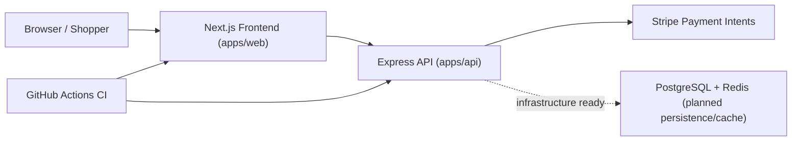

# Multi-Platform E-Commerce Web Application
Full-stack portfolio project aligned to ANZSCO 261312 (Developer Programmer).

## Portfolio Context
- Full ANZSCO 261312 portfolio landing page: [projects-workspaces](https://github.com/jen-the-dev/projects-workspaces)
- Application cover letter template: [cover-letter-anzsco-261312.md](https://github.com/jen-the-dev/cicd-automated-infrastructure/blob/main/cover-letter-anzsco-261312.md)
- Related core showcase repositories:
  - [cloud-native-task-management-api](https://github.com/jen-the-dev/cloud-native-task-management-api)
  - [realtime-data-streaming-dashboard](https://github.com/jen-the-dev/realtime-data-streaming-dashboard)
  - [cicd-automated-infrastructure](https://github.com/jen-the-dev/cicd-automated-infrastructure)

## Problem
Retail platforms need a coherent architecture that connects frontend UX, backend business logic, and secure payment integration without sacrificing maintainability.

## Solution
This repository implements a two-tier full-stack structure:
- Next.js storefront UI for catalog browsing,
- Express API for product, cart, and payment-intent workflows,
- Stripe-compatible payment flow with safe mock fallback,
- CI checks and automated tests for backend behavior.

## Architecture Diagram

## Tech Stack
- Frontend: Next.js + React
- Backend: Node.js + Express
- Payments: Stripe API
- Infrastructure wiring: PostgreSQL + Redis via Docker Compose
- CI: GitHub Actions

## Setup Instructions
1. `cd apps/api && npm install`
2. `cd ../web && npm install`
3. `cd ../.. && docker compose up --build`
4. Start frontend: `cd apps/web && npm run dev`

## Testing
- Backend unit/integration tests:
  - `cd apps/api && npm test`
- Backend syntax checks:
  - `cd apps/api && npm run check`
- Frontend static check:
  - `cd apps/web && npm run check`

## ANZSCO 261312 Competency Evidence
- **Software solution design**: frontend/backend separation and clear API boundaries in `apps/web` and `apps/api`.
- **Programming and integration**: commerce routes in `apps/api/src/app.js`, Stripe flow integration in `apps/api/src/index.js`.
- **Testing and quality**: unit tests in `apps/api/test/catalog.unit.test.js`, integration tests in `apps/api/test/app.integration.test.js`.
- **Operational delivery**: CI automation for web and API in `.github/workflows/ci.yml`.

## Commit Convention
Use Conventional Commits for clear change history:
- `feat(cart): support quantity updates for existing cart items`
- `fix(payment): handle invalid amount in payment intent route`
- `test(api): add integration test for mock payment mode`
- `docs(readme): add architecture and competency mapping`

## Evidence Map
- Frontend storefront: `apps/web/pages/index.tsx`
- API composition: `apps/api/src/app.js`
- Product/catalog utilities: `apps/api/src/catalog.js`
- Tests: `apps/api/test/`
- CI pipeline: `.github/workflows/ci.yml`
